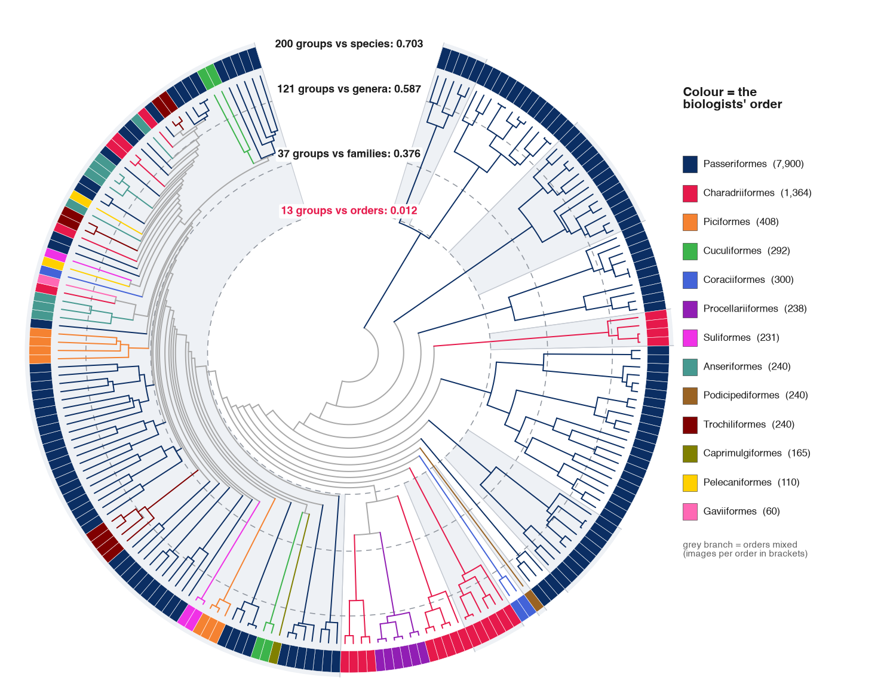
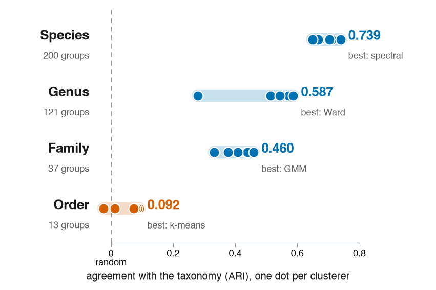
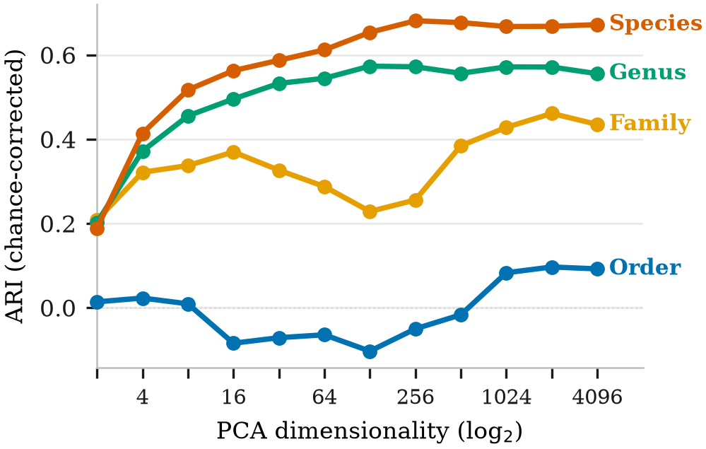
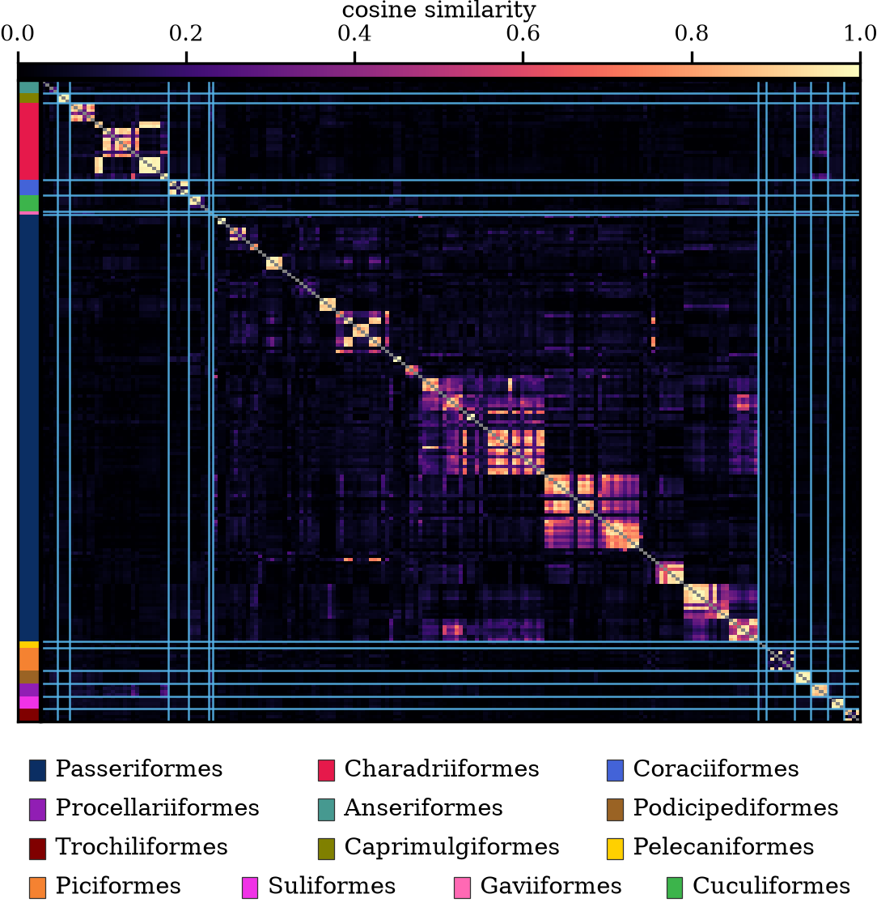
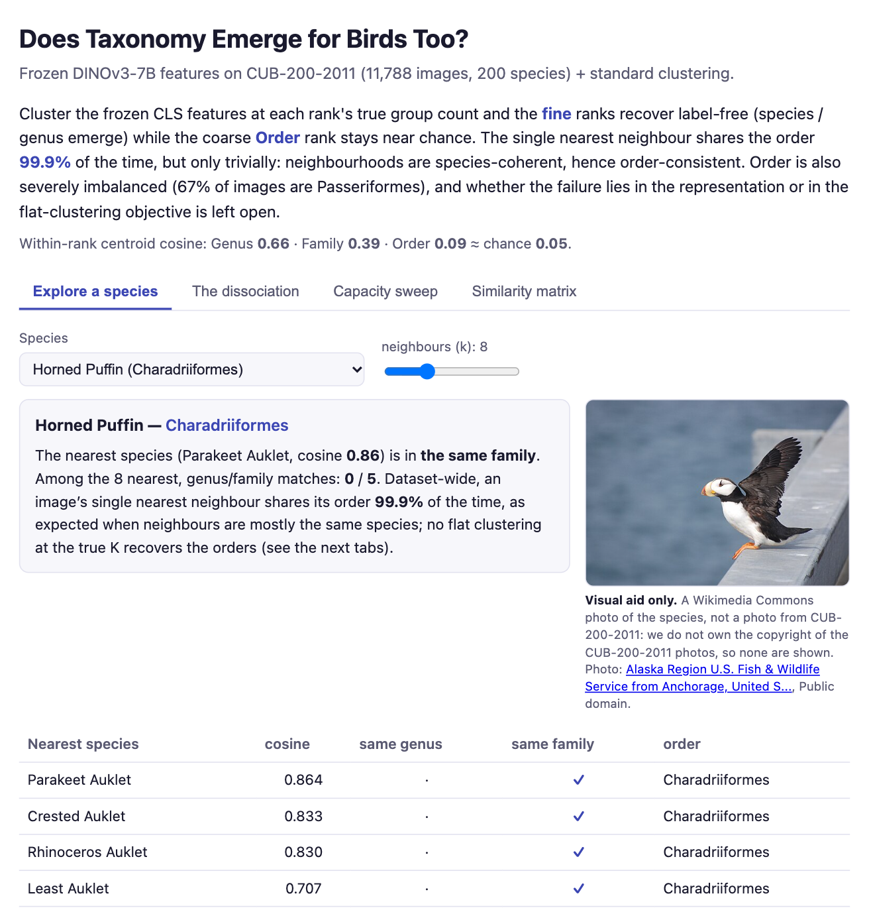

# Does Taxonomy Emerge for Birds Too? A Fine-Coarse Dissociation in Label-Free Taxonomic Recovery on CUB-200

[](https://github.com/ricardojmveiga/cub200-dinov3-taxonomy/actions/workflows/ci.yml)
[](LICENSE)
[](DATA_TERMS.md)
[](#tests-and-ci)
[](https://huggingface.co/datasets/ricardojmveiga/cub200-dinov3-taxonomy)
[](https://huggingface.co/spaces/ricardojmveiga/cub200-dinov3-taxonomy)

Code and data for the RECPAD 2026 paper by Ricardo J. M. Veiga and João M. F. Rodrigues
(NOVA LINCS & ISE, Universidade do Algarve, Faro, Portugal).

On CUB-200-2011, frozen DINOv3-7B CLS features clustered without labels recover the fine ranks
(species Adjusted Rand Index up to 0.739, genus 0.587), while the coarse Order rank stays near
chance: ARI at most 0.092 across six standard clusterers, and below 0.1 at every dimensionality of a
PCA sweep.

<p align="center">
  
</p>
<p align="center"><sub>
The paper's Ward clustering drawn as a tree. Ward builds one tree over the 11,788 images; cut into 200, 121, 37
and 13 groups, it scores ARI 0.703, 0.587, 0.376 and 0.012 against species, genera, families and orders (Table 1).
Rim tiles: the order most images of each of the 200 groups belong to. Branches are coloured by order where every
group below shares one, grey where orders mix; the shaded sectors are the 13 groups. Drawn by
<a href="docs/make_readme_figures.py">docs/make_readme_figures.py</a> from the released embeddings.
</sub></p>

- **Embeddings** (193 MB): [Hugging Face dataset `ricardojmveiga/cub200-dinov3-taxonomy`](https://huggingface.co/datasets/ricardojmveiga/cub200-dinov3-taxonomy), also attached to the [v1.0.0 release](https://github.com/ricardojmveiga/cub200-dinov3-taxonomy/releases/tag/v1.0.0)
- **Interactive demo**: [Hugging Face Space `ricardojmveiga/cub200-dinov3-taxonomy`](https://huggingface.co/spaces/ricardojmveiga/cub200-dinov3-taxonomy)

**Built with DINOv3.**

## Results at a glance

<table>
  <tr>
    <td width="50%" valign="top"><br>
      <sub><b>Six clusterers, one dot each</b> (Table 1, mean ARI at each rank's true number of groups). Species
      and genus recover; no method lifts Order above 0.092.</sub></td>
    <td width="50%" valign="top"><br>
      <sub><b>Figure 1.</b> ARI against PCA dimensionality under flat k-means. Species and genus reach their
      full-dimensional score by 256 dimensions; Order stays near chance at every dimensionality.</sub></td>
  </tr>
</table>

<p align="center">
  
</p>
<p align="center"><sub>
<b>Figure 2.</b> Cosine similarity of the 200 species centroids in 4096-D, ordered by taxonomy. Genus and family
blocks light up along the diagonal; the 67% of images that are Passeriformes form no order-level block.
</sub></p>

## Interactive demo

[](https://huggingface.co/spaces/ricardojmveiga/cub200-dinov3-taxonomy)

<sub>Pick a species to see its nearest species in DINOv3's feature space; other tabs show the six clusterers, the
PCA sweep and the similarity matrix at every dimensionality. The photo is a visual aid from Wikimedia Commons, not a
CUB-200-2011 image (here: U.S. Fish &amp; Wildlife Service, public domain). It runs in the browser; nothing to install.</sub>

## Quick start: the paper's figures and Table 1 (no GPU, no dataset)

Python 3.9 or newer. On macOS and Linux:

```bash
git clone https://github.com/ricardojmveiga/cub200-dinov3-taxonomy.git
cd cub200-dinov3-taxonomy
python3 setup_env.py                  # creates .venv and installs the CPU dependencies
.venv/bin/python -m pytest tests/     # 46 tests; 1 skips until the embeddings are fetched
.venv/bin/python 04_make_figures.py   # Figure 1, Figure 2, Table 1 and the paper's values
```

On Windows, use `py setup_env.py`, then `.venv\Scripts\python -m pytest tests/` and
`.venv\Scripts\python 04_make_figures.py`. Activating the environment first
(`source .venv/bin/activate`, or `.venv\Scripts\activate` on Windows) lets you type `python` instead.
With [uv](https://docs.astral.sh/uv/), the equivalent is
`uv venv --python 3.13 .venv` followed by
`uv pip install --python .venv/bin/python -r requirements.txt` (add `-r requirements-torch.txt` for step 1).

This takes a few minutes, most of it installing packages. Everything it needs is bundled in
[`data/`](data/): the integer taxonomy labels, the image order, the 200 species centroids and the
stored clustering results. The tests check every number in the paper's Table 1 and preamble
against those files, and CI runs them on Linux, Windows and macOS. The one number that needs the
embeddings is the nearest-neighbour check (99.9 %), which runs once they are fetched (below).
Running the tests or step 4 rewrites the files in `figures/`; under another matplotlib version they
differ from the committed ones in bytes, not in what they show.

## Full pipeline, from the images

| Step | Script | Needs | What it does |
| --- | --- | --- | --- |
| 0 | `00_download_dataset.py` | ~2.3 GB disk | Downloads CUB-200-2011 from CaltechDATA (1.15 GB, kept after extraction) and extracts the 11,788 images. |
| 1 | `01_extract_embeddings.py` | a CUDA GPU, Apple silicon with 24 GB of memory, or a CPU with 32 GB of RAM (see the notes); access to the gated DINOv3 weights | Frozen DINOv3-7B CLS token → `(11788, 4096)` float32, L2-normalised, in the order of `data/cub200_image_paths.json`. |
| 2 | `02_run_experiments.py` | CPU, the embeddings | E1 divisive vs flat, **E2 the six clusterers (Table 1)**, **E3 the PCA sweep (Figure 1)**. `--smoke` runs on random features instead (ARI ≈ 0 check, one to two minutes). |
| 3 | `03_compute_centroids.py` | any device, the embeddings | Species centroids (Figure 2) and **kNN@1@Order = 99.9 %**. |
| 4 | `04_make_figures.py` | CPU | Figure 1, Figure 2, Table 1 and the result values, from `data/`. |

```bash
python3 setup_env.py --with-torch                  # adds PyTorch, torchvision and transformers
.venv/bin/python 00_download_dataset.py
.venv/bin/python 01_extract_embeddings.py          # see the notes below
.venv/bin/python 02_run_experiments.py             # CPU, about 80 minutes
.venv/bin/python 03_compute_centroids.py
.venv/bin/python 04_make_figures.py
```

You can skip steps 0 and 1 by downloading the released embeddings:

```bash
.venv/bin/python fetch_embeddings.py   # SHA-256 checked; Hugging Face if huggingface_hub is installed, else the GitHub release
```

Notes:

- Steps 2 to 4 need only `requirements.txt`. Step 1 also needs `requirements-torch.txt`
  (`python3 setup_env.py --with-torch`: PyTorch, torchvision and `transformers` 4.56 or newer; on
  Linux the default PyPI wheels already include CUDA, otherwise see <https://pytorch.org>).
- The DINOv3 weights are gated on Hugging Face: request access by accepting the DINOv3 License on
  the [model page](https://huggingface.co/facebook/dinov3-vit7b16-pretrain-lvd1689m) (requests are
  approved manually, which can take a while), then log in once with `.venv/bin/hf auth login` (or
  set `HF_TOKEN`) before step 1. The first run downloads about 27 GB into the Hugging Face cache
  (`~/.cache/huggingface`, or wherever `HF_HOME` points). Your use of the model is governed by that
  licence.
- Step 1 matches the extraction behind the released file (bfloat16 weights, forward pass under
  bfloat16 autocast, float32 before normalising), so a re-extraction agrees with it closely, not bit
  for bit. Measured on the first 10 images, each run compared with the released vectors:

  | Device | Precision | Speed | Memory | Cosine to the released vectors |
  | --- | --- | --- | --- | --- |
  | CUDA, RTX 3090 (24 GB) | bfloat16 | about 0.26 s per image | 14.4 GB of GPU memory | ≥ 0.99993 |
  | Apple MPS, M3 with 24 GB | bfloat16 | about 18 s per image | 17.1 GB peak | ≥ 0.99994 |
  | CPU, 24-core x86 | float32 | about 17 s per image | 28.3 GB peak resident | ≥ 0.99989 |

  The device is picked automatically (CUDA, then MPS, then CPU). `--dtype bf16` on that CPU was
  slower (97 s per image, 40 GB peak resident), so keep the default there. Loading the model takes
  about a minute the first time, plus the 27 GB download.
  `--limit 10 --out data/smoke_10.npy` is a quick check; without `--out` it overwrites
  `data/cub200_cls_embeddings.npy`.
- `02_run_experiments.py --control` writes `cub_experiments_control_rerun.json` and `--n N` writes
  `cub_experiments_subsample.json`; neither replaces the bundled results.
- A full step-2 run writes `data/experiments_out/cub_experiments_real.json`, which step 4 then uses
  in place of the bundled results. The paper's runs used all 24 cores of the authors' workstation:
  there, `02_run_experiments.py --threads 24` reproduces all 24 cells of Table 1 exactly (E2 takes
  about 20 minutes). By default the script leaves one core free.
- Spectral clustering is the one method whose exact values depend on the number of CPU threads. Its
  15-nearest-neighbour graph splits into 42 disconnected pieces, so rounding differences decide
  between equally valid solutions. With 23 threads instead of 24, its family, genus and species ARI
  come out as 0.304, 0.265 and 0.696 instead of 0.333, 0.279 and 0.739; with other thread counts the
  species value ranged from 0.49 to 0.75. The other five methods reproduce to three decimals. The
  bundled JSON files are the reference the tests use.
- Step 3 overwrites the bundled centroid files in `data/` (with identical values if the embeddings
  are the released ones); `--out DIR` writes them elsewhere.

## Platforms and devices

Every script runs on Linux, Windows and macOS (Apple silicon included). Paths go through
`pathlib` in [`reprocub/common.py`](reprocub/common.py), and the compute device is picked
automatically (CUDA, then Apple MPS, then CPU; steps 1 and 3 and the benchmark take `--device` to force one). On CPU, BLAS, OpenMP and
PyTorch are capped at all cores but one, so a laptop stays responsive. Seeds are fixed
(`42, 123, 456, 789, 2024`).

## Benchmark: CUDA, Apple MPS and CPU

```bash
python3 setup_env.py --with-torch
.venv/bin/python benchmark.py --label my-machine   # times every device available here
```

It times the two hot paths and writes `benchmarks/benchmark_<label>_all.json`:

- **kNN@1@Order**: the 11,788 × 11,788 cosine nearest-neighbour search.
- **k-means, K = 200**: a fixed-budget Lloyd k-means (25 iterations, one matrix product per
  iteration) run as the same algorithm on every device, plus scikit-learn's MiniBatch k-means, the
  clusterer the paper uses, timed on CPU as a reference.

On the authors' machines (median of 5 runs; CPU uses all cores but one):

| Machine | Device | kNN@1@Order | k-means K=200 (Lloyd) | MiniBatch (reference) |
| --- | --- | --- | --- | --- |
| RTX 3090, Linux/x86 | CUDA | 0.056 s | 0.046 s | |
| RTX 3090, Linux/x86 | CPU, 23 threads | 1.87 s | 3.71 s | 76.3 s |
| MacBook Air M3, macOS/ARM | MPS | 0.53 s | 0.62 s | |
| MacBook Air M3, macOS/ARM | CPU, 7 threads | 1.02 s | 0.88 s | 21.1 s |

For unit-norm rows, `argmin‖x−c‖² = argmax(⟨x,c⟩ − ½‖c‖²)`, so the k-means assignment step is a
single matrix product on cuBLAS, MPS or the CPU BLAS. The benchmark only times the search;
`03_compute_centroids.py` scores it, and gives 11,778 / 11,788 (99.9 %) on CUDA, MPS, PyTorch CPU
and the scikit-learn fallback alike.

## Tests and CI

`python -m pytest tests/` runs on every push, on Linux, Windows and macOS with Python 3.9, 3.11,
3.12 and 3.13 ([`.github/workflows/ci.yml`](.github/workflows/ci.yml)):

- `test_common.py`: paths, the cores-minus-one policy, device choice, label counts (11,788 images;
  13 / 37 / 121 / 200 groups).
- `test_sanity.py`: random features give ARI ≈ 0 while NMI is inflated at this small n.
- `test_experiments.py`: every clusterer runs and scores chance on noise; seeds and per-method
  seed budgets as in the paper.
- `test_reproduce.py`: within-rank centroid cosines, Table 1 cells, and that Figures 1 and 2
  regenerate from `data/`.
- `test_headline_claims.py`: all 24 Table 1 cells, the PCA-sweep peaks and the Order ceiling, the
  67 % majority order, the random-feature control, the paper's 24 result macros
  (`data/paper_macros.tex`), and kNN@1@Order = 11,778 / 11,788 (skipped until the embeddings are
  fetched).

## Layout

```text
cub200-dinov3-taxonomy/
├── 00_download_dataset.py … 04_make_figures.py   # numbered pipeline steps
├── fetch_embeddings.py        # download the released embeddings (Hugging Face / GitHub release)
├── benchmark.py               # CUDA / MPS / CPU timing
├── setup_env.py               # cross-platform venv + dependencies
├── requirements.txt           # CPU dependencies (steps 2-4, tests)
├── requirements-torch.txt     # extraction and GPU/MPS
├── reprocub/                  # the package: paths and devices, clusterers, figure generators
├── data/                      # labels, image list, species and order names, centroids,
│                              #   clustering results, the paper's result macros
├── figures/                   # regenerated figures
├── docs/                      # README images; make_readme_figures.py redraws tree.png and methods.png
├── benchmarks/                # timing files behind the benchmark table
├── tests/                     # pytest suite
├── third_party/               # licences of the DINOv3 model and the CUB hierarchy
├── LICENSE, DATA_TERMS.md, CITATION.cff
└── .github/workflows/ci.yml   # Linux + Windows + macOS
```

## Licence

The code is released under the [MIT License](LICENSE). The data (`data/`, `figures/` and the
embeddings) are not covered by it: they derive from CUB-200-2011, DINOv3 and the Barz and Denzler
hierarchy, and may be used only for non-commercial research and educational purposes. See
[DATA_TERMS.md](DATA_TERMS.md). Built with DINOv3.

## Provenance and credits

- **Images**: CUB-200-2011 (C. Wah, S. Branson, P. Welinder, P. Perona and S. Belongie, Caltech
  technical report CNS-TR-2011-001, 2011, [doi:10.22002/D1.20098](https://doi.org/10.22002/D1.20098)).
  No images are included; `00_download_dataset.py` downloads them from CaltechDATA.
  `data/cub200_image_paths.json` is the dataset's image list, in its original order.
- **Features**: frozen `facebook/dinov3-vit7b16-pretrain-lvd1689m` (O. Siméoni et al., *DINOv3*,
  arXiv:2508.10104, 2025), CLS token, 512 × 512 input, used under the
  [DINOv3 License](https://ai.meta.com/resources/models-and-libraries/dinov3-license/)
  (copy in [third_party/](third_party/)).
- **Taxonomy**: order, family and genus labels from the Wikispecies-derived CUB-200-2011 hierarchy
  of B. Barz and J. Denzler ([cvjena/semantic-embeddings](https://github.com/cvjena/semantic-embeddings),
  folder `CUB-Hierarchy`; MIT License, Copyright (c) 2020 Björn Barz), integer-encoded per image in
  `data/cub200_labels.json`.

## Citation

If you use this code or data, please cite the paper (GitHub's "Cite this repository" button reads
[CITATION.cff](CITATION.cff)):

```bibtex
@inproceedings{veiga2026birds,
  author    = {Veiga, Ricardo J. M. and Rodrigues, Jo{\~a}o M. F.},
  title     = {Does Taxonomy Emerge for Birds Too? {A} Fine-Coarse Dissociation in Label-Free
               Taxonomic Recovery on {CUB-200}},
  booktitle = {Proc. 32nd Portuguese Conference on Pattern Recognition (RECPAD)},
  address   = {Viseu, Portugal},
  year      = {2026}
}
```

Please also cite the three sources the data come from:

```bibtex
@techreport{wah2011cub,
  author      = {Wah, Catherine and Branson, Steve and Welinder, Peter and Perona, Pietro and Belongie, Serge},
  title       = {The {Caltech-UCSD} {Birds-200-2011} Dataset},
  institution = {California Institute of Technology},
  number      = {CNS-TR-2011-001},
  year        = {2011}
}
@misc{simeoni2025dinov3,
  author        = {Sim{\'e}oni, Oriane and others},
  title         = {{DINOv3}},
  year          = {2025},
  eprint        = {2508.10104},
  archivePrefix = {arXiv}
}
@inproceedings{barz2020cosine,
  author    = {Barz, Bj{\"o}rn and Denzler, Joachim},
  title     = {Deep Learning on Small Datasets without Pre-Training using Cosine Loss},
  booktitle = {Proc. IEEE Winter Conf. Appl. Comput. Vis. (WACV)},
  pages     = {1360--1369},
  year      = {2020},
  doi       = {10.1109/WACV45572.2020.9093286}
}
```

## Acknowledgements

This work is supported by the Fundação para a Ciência e a Tecnologia (FCT) PhD grant
2022.11602.BD, and by NOVA LINCS (UID/04516/2025) with the financial support of FCT.IP.
